# AbiCut

<p align="center">
  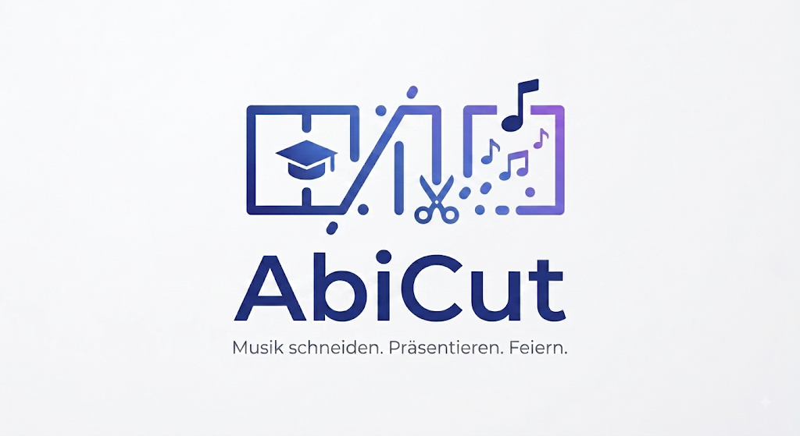
</p>

**AbiCut** is a Python desktop application for preparing and controlling music segments together with PowerPoint slides during live school events.

The project was developed for a real graduation-event workflow: each presentation slide can be assigned to a student and a specific Spotify track segment. AbiCut combines project preparation, Spotify integration, PowerPoint monitoring and a dedicated live view in one application.

## Overview

During a graduation ceremony, individual presentation slides can require a specific part of a song to start at exactly the right moment. Managing this manually becomes difficult when many students, songs and timings have to be coordinated reliably.

AbiCut provides a structured workflow for this process:

1. Create a project from an Excel class list.
2. Optionally import a Spotify playlist.
3. Assign and verify songs for each slide.
4. Define start position, duration and fade settings.
5. Confirm the configuration before the event.
6. Start Live Mode and let AbiCut react to PowerPoint slide changes.

## Features

- **Project Wizard**
  - creates a new AbiCut project
  - imports student names from `.xlsx` or `.xls` files
  - automatically detects common name-column formats
  - can import a Spotify playlist directly during setup

- **Project Management**
  - open and manage multiple projects
  - duplicate, rename and delete projects
  - keep track of project preparation progress

- **Spotify Integration**
  - Spotify OAuth authentication
  - playlist import
  - track metadata retrieval
  - playback control
  - seek to a defined track position
  - automatic fade-in and fade-out

- **Slide Editor**
  - assign songs to individual presentation slides
  - configure start position and playback duration
  - define fade-in and fade-out values
  - test configured track segments
  - enable or disable individual slides
  - explicitly confirm timing configuration

- **PowerPoint Integration**
  - reads the current PowerPoint slideshow position through Windows COM
  - detects slide changes during the presentation
  - triggers the configured Spotify segment for the active slide

- **Live Monitor**
  - displays the current slide and student
  - shows the active song
  - previews the next slide / student / song
  - displays playback progress and remaining time
  - distinguishes between active, disabled and unconfigured slides

- **JSON-based Project Storage**
  - project metadata and slide configuration are stored in readable JSON files
  - each student receives a unique ID
  - configuration states such as `enabled`, `song_added` and `time_confirmed` are stored explicitly

## Architecture

```text
Excel class list ────────┐
                         │
Spotify playlist ────────┼──> Project Wizard
                         │        │
                         │        v
                         │   Project config (JSON)
                         │        │
                         │        v
                         └──> AbiCut Editor
                                  │
                       ┌──────────┴──────────┐
                       │                     │
                       v                     v
                Spotify Web API       PowerPoint COM
                       │                     │
                       └──────────┬──────────┘
                                  v
                           Live Controller
                                  │
                                  v
                            Live Monitor
```

The application is split into dedicated modules for project management, configuration, Spotify control, PowerPoint communication, editing and live operation.

## Example Project Data

A simplified project configuration is included as:

```text
config.example.json
```

Each slide can contain data such as:

```json
{
  "student": "Max Mustermann",
  "student_id": "example-student-001",
  "song": "Example Song",
  "artist": "Example Artist",
  "uri": "spotify:track:EXAMPLE_TRACK_ID",
  "start_ms": 15000,
  "duration_ms": 30000,
  "fade_in": 2.0,
  "fade_out": 2.0,
  "enabled": true,
  "song_added": true,
  "time_confirmed": true
}
```

This makes the project state transparent and reproducible without storing real student or event data in the public repository.

## Tech Stack

- **Python**
- **Tkinter / ttk** — desktop user interface
- **Spotipy** — Spotify Web API integration
- **Spotify OAuth**
- **pywin32 / win32com** — PowerPoint automation and slideshow monitoring
- **pandas** — Excel class-list import
- **openpyxl / xlrd** — Excel file support
- **JSON** — project and settings storage
- **threading** — playback timing and fades

## Requirements

AbiCut currently targets **Windows**, because the PowerPoint integration uses `win32com`.

You need:

- Python 3
- Microsoft PowerPoint desktop application
- a Spotify developer application / API credentials
- an available Spotify playback device
- the Python packages listed in `requirements.txt`

## Installation

Clone the repository:

```bash
git clone https://github.com/leonstein2611/abicut.git
cd abicut
```

Install the dependencies:

```bash
pip install -r requirements.txt
```

## Spotify Configuration

Real Spotify credentials are intentionally **not** stored in this repository.

AbiCut requires valid Spotify API credentials **before the first application start**.

Create a local settings file from the provided example:

### PowerShell

```powershell
Copy-Item settings.example.json settings.json
```

Then open `settings.json` and enter your own Spotify application credentials:

```json
{
  "spotify": {
    "client_id": "YOUR_SPOTIFY_CLIENT_ID",
    "client_secret": "YOUR_SPOTIFY_CLIENT_SECRET",
    "redirect_uri": "http://127.0.0.1:8888/callback"
  },
  "defaults": {
    "song_duration": 30000,
    "fade_in": 2,
    "fade_out": 2,
    "start_ms": 0
  }
}
```

`settings.json` is excluded through `.gitignore` and should remain local.

Important: Configure client_id and client_secret before running main.py.
The Spotify connection is initialized during application startup.

## Running AbiCut

After installing the dependencies and configuring your Spotify credentials, start the application with:

```bash
python main.py
```

For Live Mode:

1. Open the prepared PowerPoint presentation.
2. Start the PowerPoint slideshow.
3. Make sure a Spotify playback device is active.
4. Open the prepared AbiCut project.
5. Start Live Mode.
6. Changing the PowerPoint slide triggers the corresponding configured Spotify segment.

## Project Structure

```text
abicut/
├── main.py                  # Application entry point
├── startscreen.py           # Main menu / project overview
├── project_wizard.py        # New-project workflow
├── project_manager.py       # Project management
├── project_controller.py    # Current-project handling
├── project_statistics.py    # Project progress / statistics
├── class_importer.py        # Excel class-list import
├── playlist_importer.py     # Spotify playlist import
├── gui.py                   # Main project editor
├── slide_editor.py          # Detailed slide configuration
├── spotify_connection.py    # Spotify connection handling
├── spotify_controller.py    # Spotify playback control
├── powerpoint_controller.py # PowerPoint COM integration
├── live_controller.py       # Live-event logic
├── monitor.py               # Live monitor UI
├── settings_manager.py      # Local settings persistence
├── settings_window.py       # Settings UI
├── baseWindow.py            # Shared window behavior
├── utils.py                 # Time conversion utilities
├── requirements.txt
├── settings.example.json
├── config.example.json
└── .gitignore
```

## Local Data & Privacy

The public repository intentionally excludes runtime and personal data such as:

```text
settings.json
config.json
.cache
current_project.txt
projects/
__pycache__/
```

This prevents Spotify credentials, authentication data and real student/project information from being published.

The included `settings.example.json` and `config.example.json` files document the required structures using placeholder data.

## Project Status

**Completed / operational**

AbiCut was developed as a complete desktop application for a real school event workflow. The application combines preparation, validation and live control instead of focusing only on a single playback script.

The public repository is intended to document the technical implementation while keeping credentials and real project data private.

## Background

AbiCut grew from the practical requirement to coordinate PowerPoint slides and individual music segments reliably during a graduation event.

What started as a smaller event-control tool developed into a modular desktop application with project management, Excel and Spotify imports, editing and validation tools, persistent JSON project data and a dedicated Live Controller.

## Application Workflow

### 1. Create a Project

AbiCut starts with a project wizard. A project name, Excel class list and optionally a Spotify playlist can be provided during setup.

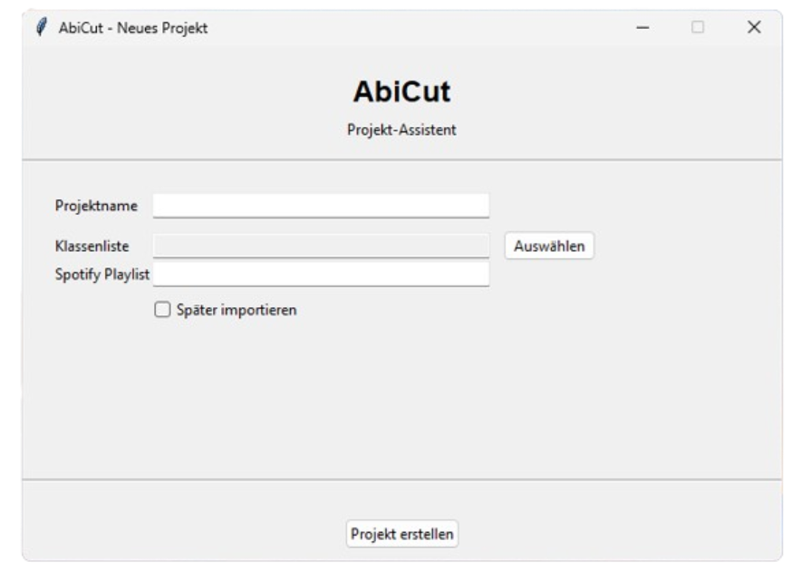

### 2. Import Students

Student names are imported from the selected Excel file. AbiCut detects the relevant name columns and creates the slide structure automatically.

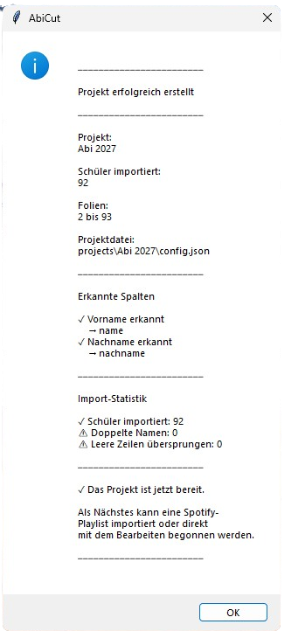

### 3. Import a Spotify Playlist

A Spotify playlist can be imported and matched to the generated student slides.

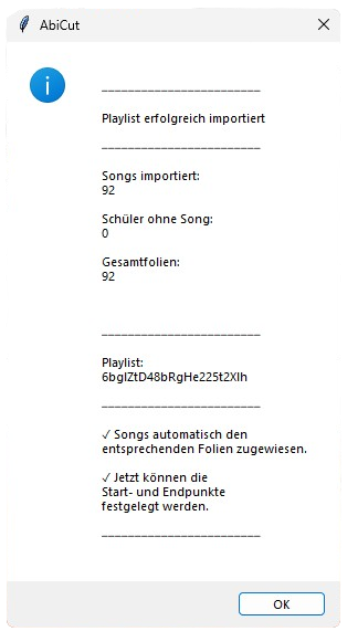

### 4. Manage Projects

The main screen and project manager provide an overview of preparation progress and allow existing projects to be opened, duplicated, renamed or deleted.

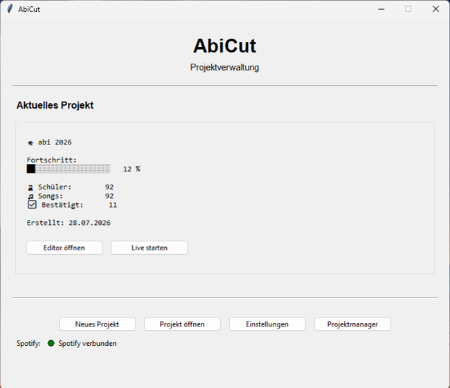

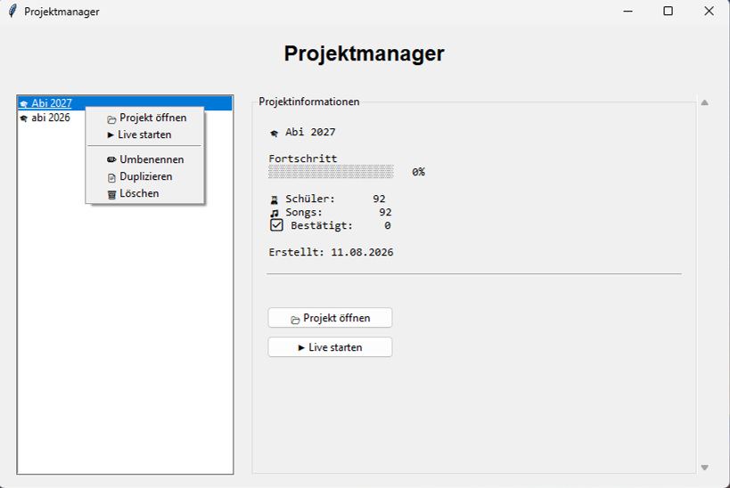

### 5. Configure Music Segments

The editor shows all slides and their preparation state. For each slide, the song, playback position, duration and fade values can be configured and verified.

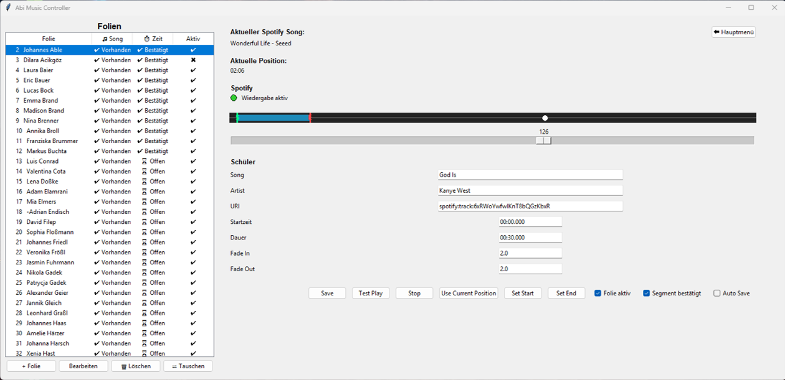

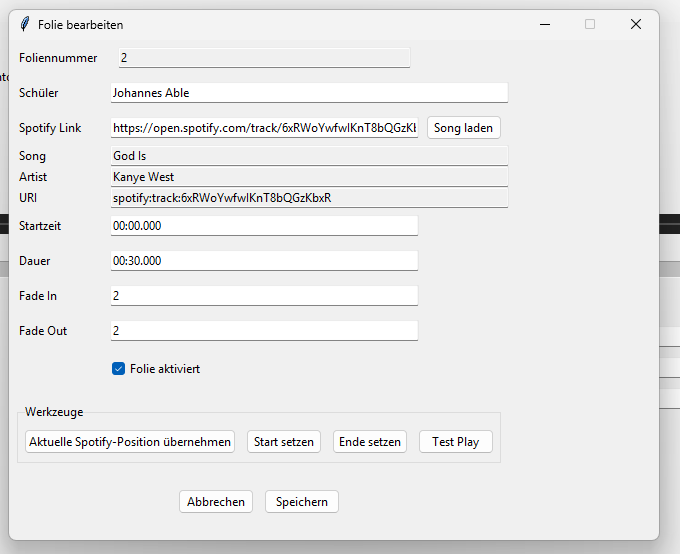

### 6. Configure Defaults

Default values for start position, song duration and fades can be configured globally.

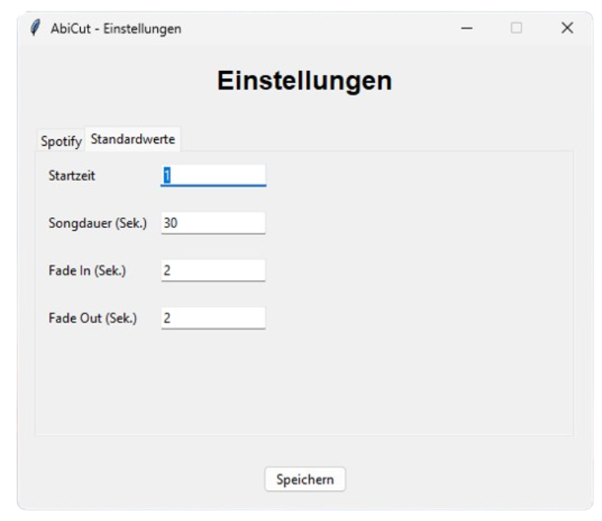

### 7. Run the Event

During Live Mode, AbiCut reacts to PowerPoint slide changes and displays the current playback state.

| Unconfigured | Playing | Disabled |
|---|---|---|
| 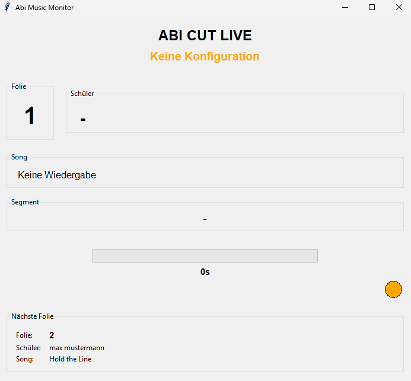 | 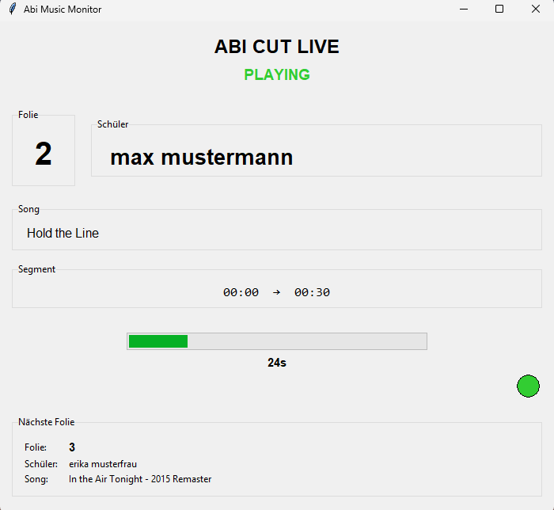 | 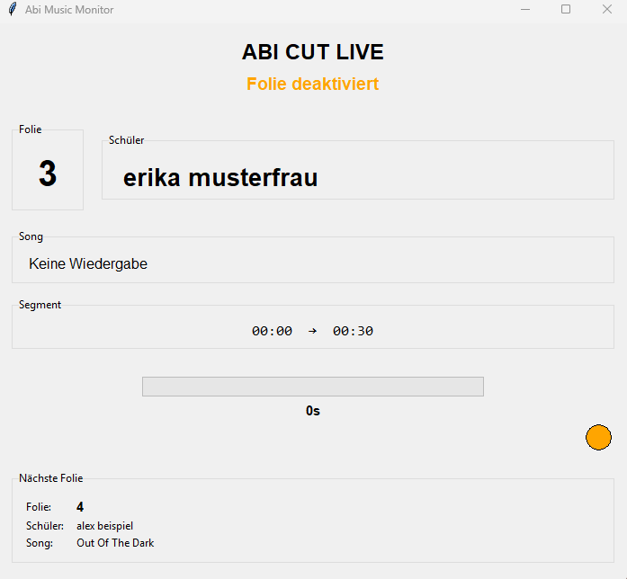 |

## Author

**Leon Stein**

Robotics & Autonomous Systems / technical projects in software, embedded systems and automation.
